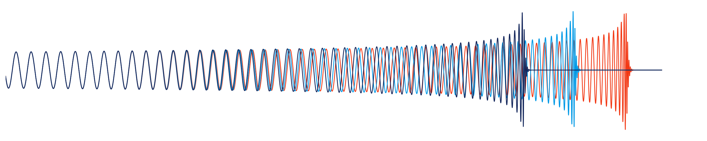

### About me

Hi! I am Lorenzo Pompili, a PhD student in the [Astrophysical and Cosmological Relativity Department](https://www.aei.mpg.de/astro-cosmo-rel) at the [Max Planck Insitute for Gravitational Physics](https://www.aei.mpg.de/), under the supervision of Prof. Alessandra Buonanno. 

I am a member of the [LIGO Scientific Collaboration](https://www.ligo.org/), the [Einstein Telescope Collaboration](https://www.et-gw.eu/index.php), and a full member of [LISA Consortium](https://www.lisamission.org/).

I am originally from [Perugia](https://en.wikipedia.org/wiki/Perugia), Italy, where I completed my undergraduate studies in Physics and went on to earn a Master's in Theoretical Physics at the University of Perugia. 

### My work

My research lies at the intersection of gravitational-wave modeling and data analysis. 

I focus on developing accurate and efficient models for the gravitational radiation emitted by coalescing compact binaries, both within General Relativity (GR) and in modified gravity theories, focusing on effective-one-body (EOB) models and their improvement through numerical relativity (NR). I am one of the main developers and a maintainer of the [pySEOBNR](https://git.ligo.org/waveforms/software/pyseobnr) python package.

Additionally, I am interested in using these models to address open questions in fundamental physics and astrophysics. I employ them for parameter estimation and tests of GR using data from current gravitational-wave detectors, LIGO, Virgo, and KAGRA. I also work on making forecasts for next-generation gravitational-wave detectors, including LISA and the Einstein Telescope, focusing on the challenges and accuracy requirements these future instruments will face.

