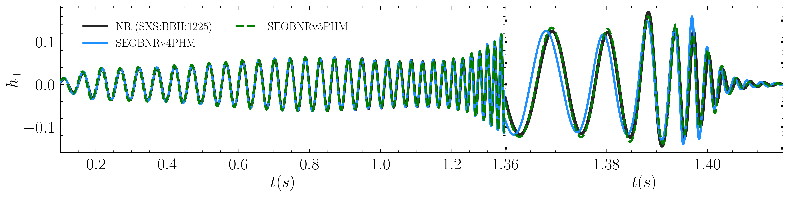

List of selected publications in reversed chronological order. As a member of the LIGO Scientific Collaboration, I am a co-author on several full-collaboration papers. Highlighted below are those to which I have made a direct personal contribution. See [INSPIRE](https://inspirehep.net/authors/2776658) for a complete list.

### Selected publications

**[12]** Félix-Louis Julié, **Lorenzo Pompili**, Alessandra Buonanno *Inspiral-merger-ringdown waveforms in Einstein-scalar-Gauss-Bonnet gravity within the effective-one-body formalism*  
Submitted to Phys.Rev.D., [arXiv:2406.13654](https://arxiv.org/abs/2406.13654)

**[11]** Alessandra Buonanno, Gustav Mogull, Raj Patil, **Lorenzo Pompili**, *Post-Minkowskian Theory Meets the Spinning Effective-One-Body Approach for Bound-Orbit Waveforms*  
Submitted to Phys.Rev.Lett., [arXiv:2405.19181](https://arxiv.org/abs/2405.19181)

**[10]** Anuradha Gupta et al. (inc. **Lorenzo Pompili**), *Possible Causes of False General Relativity Violations in Gravitational Wave Observations*  
[arxiv:2405.02197](https://arxiv.org/abs/2405.02197)

**[9]** Arnab Dhani et al. (inc. **Lorenzo Pompili**), *Systematic Biases in Estimating the Properties of Black Holes Due to Inaccurate Gravitational-Wave Models*  
Submitted to Phys.Rev.X, [arXiv:2404.05811](https://arxiv.org/abs/2404.05811)

**[8]** LIGO-Virgo-KAGRA Collaboration (inc. **Lorenzo Pompili**), *Observation of Gravitational Waves from the Coalescence of a $$\sim 2.5-5 M_\odot$$ Compact Object and a Neutron Star*  
Submitted to ApJL, [arXiv:2404.04248](https://arxiv.org/abs/2404.04248)

**[7]** LISA Consortium Waveform Working Group (inc. **Lorenzo Pompili**), *Waveform Modelling for the Laser Interferometer Space Antenna*  
Submitted to Living Rev.Rel., [arXiv:2311.01300](https://arxiv.org/abs/2311.01300)

**[6]** Alexandre Toubiana, **Lorenzo Pompili** et al., *Measuring source properties and quasi-normal-mode frequencies of heavy massive black-hole binaries with LISA*  
Phys. Rev. D 109 (2024) 10, 104019, [arXiv:2307.15086](https://arxiv.org/abs/2307.15086)

**[5]** Deyan P. Mihaylov et al. (inc. **Lorenzo Pompili**), *pySEOBNR: a software package for the next generation of effective-one-body multipolar waveform models*  
Submitted to SoftwareX, [arXiv:2303.18203](https://arxiv.org/abs/2303.18203)

**[4]** Maarten van de Meent et al. (inc. **Lorenzo Pompili**), *Enhancing the SEOBNRv5 effective-one-body waveform model with second-order gravitational self-force fluxes*  
Phys.Rev.D 108 (2023) 12, 124038, [arXiv:2303.18026](https://arxiv.org/abs/2303.18026)

**[3]** Antoni Ramos-Buades et al. (inc. **Lorenzo Pompili**), *SEOBNRv5PHM: Next generation of accurate and efficient multipolar precessing-spin effective-one-body waveforms for binary black holes*  
Phys.Rev.D 108 (2023) 12, 124037, [arXiv:2303.18046](https://arxiv.org/abs/2303.18046)

**[2]** Mohammed Khalil et al. (inc. **Lorenzo Pompili**), *Theoretical groundwork supporting the precessing-spin two-body dynamics of the effective-one-body waveform models SEOBNRv5*  
Phys.Rev.D 108 (2023) 12, 124036, [arXiv:2303.18143](https://arxiv.org/abs/2303.18143)

**[1]** **Lorenzo Pompili** et al., *Laying the foundation of the effective-one-body waveform models SEOBNRv5: improved accuracy and efficiency for spinning non-precessing binary black holes*  
Phys.Rev.D 108 (2023) 12, 124035, [arXiv:2303.18039](https://arxiv.org/abs/2303.18039)

